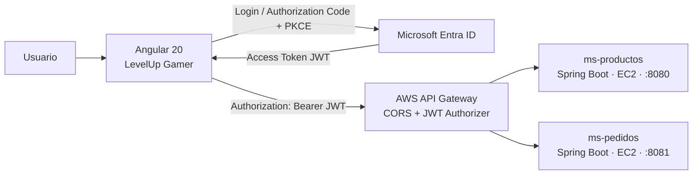

# Pedidos360 · LevelUp Gamer

Frontend Angular del sistema **Pedidos360**, una aplicación de pedidos para la tienda ficticia de hardware gamer **LevelUp Gamer**. El proyecto permite consultar el catálogo, administrar un carrito, autenticarse con Microsoft Entra ID y crear, consultar y actualizar pedidos a través de AWS API Gateway.

Proyecto académico de la asignatura **DSY1107 · Desarrollo Cloud Native I**.

> Integrantes: **Keiton Chaves - Matias Chavez**  
> Sección: **DSY1107-004V**  
> Docente: **Edwin Sanchez Valderrama**

---

## Características

- Catálogo público de productos gamer.
- Filtro de productos por categoría.
- Carrito de compras almacenado en el navegador.
- Inicio y cierre de sesión mediante **Microsoft Entra ID**.
- Autenticación con **MSAL Angular** usando Authorization Code Flow con PKCE.
- Protección de pantallas de carrito y pedidos mediante `MsalGuard`.
- Envío automático de `Authorization: Bearer <access_token>` con `MsalInterceptor` para los endpoints protegidos.
- Creación de pedidos mediante `POST /pedidos`.
- Consulta de pedidos mediante `GET /pedidos`.
- Cambio de estado del pedido mediante `PATCH /pedidos/{id}/estado`.
- Integración con microservicios Spring Boot desplegados en Amazon EC2 y expuestos mediante AWS API Gateway.
- Configuración CORS para permitir solicitudes desde `http://localhost:4200` con los headers `authorization` y `content-type`.

---

## Arquitectura



### Flujo de seguridad

1. El usuario inicia sesión desde Angular.
2. MSAL redirige a Microsoft Entra ID y obtiene un access token para la API.
3. `MsalInterceptor` agrega el token Bearer a las llamadas de pedidos.
4. AWS API Gateway valida el JWT mediante un JWT Authorizer configurado con el issuer y audience de Entra ID.
5. API Gateway reenvía las solicitudes válidas a los microservicios Spring Boot alojados en EC2.
6. CORS permite que el navegador realice requests desde el frontend local.

---

## Tecnologías

| Área | Tecnología |
|---|---|
| Frontend | Angular 20 |
| Estilos | Tailwind CSS 4 |
| Autenticación | Microsoft Entra ID / Azure AD |
| Cliente de autenticación | `@azure/msal-angular` y `@azure/msal-browser` |
| API | AWS API Gateway HTTP API |
| Infraestructura backend | Amazon EC2 |
| Backend | Microservicios Spring Boot |
| API de productos | `ms-productos` en puerto `8080` |
| API de pedidos | `ms-pedidos` en puerto `8081` |

---

## Funcionalidades y rutas

| Ruta Angular | Vista | API consumida | Seguridad |
|---|---|---|---|
| `/` | Inicio | `GET /productos` | Pública |
| `/catalogo` | Catálogo Gamer | `GET /productos` | Pública |
| `/carrito` | Carrito | `POST /pedidos` | Requiere inicio de sesión |
| `/pedidos` | Mis pedidos | `GET /pedidos`, `PATCH /pedidos/{id}/estado` | Requiere inicio de sesión |

### Endpoints consumidos

| Método | Endpoint | Uso |
|---|---|---|
| `GET` | `/productos` | Lista el catálogo de productos |
| `POST` | `/pedidos` | Crea un pedido desde el carrito |
| `GET` | `/pedidos` | Obtiene los pedidos registrados |
| `PATCH` | `/pedidos/{id}/estado` | Actualiza el estado de un pedido |

Los estados disponibles son:

```text
CREADO → PAGADO → ENVIADO → ENTREGADO
                         └→ CANCELADO
```

---

## Requisitos previos

- Node.js 20.19+ o superior.
- npm.
- Angular CLI 20.
- Acceso al tenant de Microsoft Entra ID configurado para el proyecto.
- Microservicios `ms-productos` y `ms-pedidos` disponibles en EC2 mediante API Gateway.

Comprueba las versiones instaladas:

```bash
node --version
npm --version
ng version
```

---

## Instalación y ejecución local

1. Clona el repositorio:

   ```bash
   git clone <URL_DEL_REPOSITORIO>
   cd levelupgamer
   ```

2. Instala las dependencias:

   ```bash
   npm install
   ```

3. Inicia el servidor de desarrollo:

   ```bash
   ng serve
   ```

4. Abre la aplicación:

   ```text
   http://localhost:4200
   ```

El servidor de desarrollo recarga la aplicación automáticamente al detectar cambios en los archivos fuente.

---

## Configuración de API

Las URLs de los servicios se definen en:

```text
src/environments/environment.ts
```

Ejemplo de configuración para consumir AWS API Gateway:

```ts
export const environment = {
  production: false,
  apiProductos:
    'https://<API_ID>.execute-api.<REGION>.amazonaws.com/productos',
  apiPedidos:
    'https://<API_ID>.execute-api.<REGION>.amazonaws.com/pedidos',
};
```

> No subas tokens, secretos, contraseñas, credenciales AWS ni archivos de configuración sensibles al repositorio.

---

## Configuración MSAL

La configuración de autenticación se encuentra en:

```text
src/app/app.config.ts
```

La aplicación utiliza:

- Una instancia `PublicClientApplication` para conectarse con Microsoft Entra ID.
- `MsalGuard` para restringir las rutas que requieren inicio de sesión.
- `MsalInterceptor` para obtener y adjuntar el access token a las llamadas protegidas.
- El scope expuesto por la API, con formato:

```text
api://<API_CLIENT_ID>/access_as_user
```

Para que el interceptor adjunte el token, `protectedResourceMap` debe incluir la URL del endpoint protegido de API Gateway, por ejemplo:

```ts
protectedResourceMap.set(
  'https://<API_ID>.execute-api.<REGION>.amazonaws.com/pedidos',
  ['api://<API_CLIENT_ID>/access_as_user']
);
```

Si se utilizan subrutas, como `/pedidos/{id}/estado`, estas también deben quedar cubiertas por la configuración del interceptor.

---

## Configuración CORS

En AWS API Gateway se configuró CORS para el origen local del frontend:

| Propiedad | Valor |
|---|---|
| Allowed origin | `http://localhost:4200` |
| Allowed headers | `authorization`, `content-type` |
| Allowed methods | `GET`, `POST`, `PATCH`, `DELETE`, `OPTIONS` |
| Allow credentials | No |
| Max age | `300` segundos |

Una prueba de preflight correcta responde:

```http
HTTP/1.1 204 No Content
Access-Control-Allow-Origin: http://localhost:4200
Access-Control-Allow-Headers: authorization,content-type
Access-Control-Allow-Methods: DELETE,GET,OPTIONS,PATCH,POST
```

---

## Construcción para producción

Para generar los archivos optimizados de producción:

```bash
ng build
```

Angular genera los artefactos compilados dentro de:

```text
dist/
```

Antes de desplegar el frontend, configura las URL de producción de API Gateway en el archivo de environment correspondiente y registra la URL final del frontend como Redirect URI de tipo SPA en Microsoft Entra ID.

---

## Estructura principal

```text
src/
├── app/
│   ├── models/                 Modelos de Producto y Pedido
│   ├── pages/                  Vistas de inicio, catálogo, carrito y pedidos
│   ├── services/               Servicios HTTP y gestión de carrito
│   ├── shared/                 Componentes compartidos, como header y footer
│   ├── app.config.ts           Providers Angular y configuración MSAL
│   └── app.routes.ts           Rutas de la aplicación
├── environments/               URLs de API por ambiente
└── public/img/productos/       Imágenes del catálogo
```

---

## Pruebas funcionales

Para validar el flujo completo:

1. Abrir la aplicación en `http://localhost:4200`.
2. Navegar por el catálogo sin iniciar sesión.
3. Agregar uno o más productos al carrito.
4. Iniciar sesión con Microsoft Entra ID.
5. Confirmar el pedido.
6. Verificar el mensaje de creación correcta.
7. Entrar a **Mis pedidos** y comprobar que el pedido aparece listado.
8. Cambiar su estado, por ejemplo de `CREADO` a `PAGADO`.
9. Revisar DevTools → Network para confirmar:

   ```text
   OPTIONS /pedidos                 → 204
   POST /pedidos                    → 201
   GET /pedidos                     → 200
   PATCH /pedidos/{id}/estado       → 200
   ```

---

## Repositorios relacionados

- Frontend Angular: este repositorio.
- Microservicio de productos: `[Completar URL de GitHub]`.
- Microservicio de pedidos: `[Completar URL de GitHub]`.

---

## Uso académico

Proyecto desarrollado con fines académicos para **DSY1107 · Desarrollo Cloud Native I**.